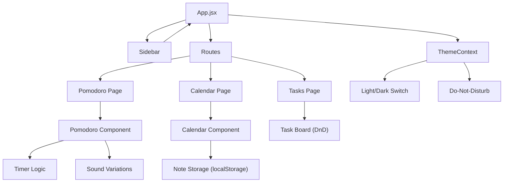

# StudySync

StudySync is an all‑in‑one study planner that helps students stay organized and productive with task management, Pomodoro focus sessions, flashcards, quizzes, goal tracking, and progress analytics. Study smarter, manage time better, and achieve your learning goals.

## ✨ Features
- **Pomodoro Timer** with configurable work/break intervals.
- **Sound variations** for the timer alarm (sine, square, triangle) and a visual alarm message.
- **Calendar** component where you can add notes per date; days with saved notes are highlighted.
- **Light / Dark theme** toggle with persistent state via `localStorage`.
- **Do‑Not‑Disturb** mode that silences notifications.
- **Drag‑and‑Drop** task board (DnD visual mode).
- Responsive layout, glass‑morphism UI, and smooth hover animations.

## 📊 Architecture Flow
Below is a high‑level component flow diagram (Mermaid).



## 🛠️ Tech Stack
- **React** (hooks, functional components)
- **Vite** for fast development and bundling
- **lucide-react** icons
- **date-fns** for date handling
- **CSS** custom variables for theming (no Tailwind)
- **Web Audio API** for custom alarm sounds
- **localStorage** for persisting notes, theme, and timer state

---

## 🚀 Getting Started
### Prerequisites
- Node.js >= 18
- npm (comes with Node) or your preferred package manager

### Installation
```bash
# Clone the repository (replace with your fork URL)
git clone https://github.com/your-username/capstone.git
cd capstone

# Install dependencies
npm install
```

### Development
```bash
npm run dev
```
Open [http://localhost:5173](http://localhost:5173) in your browser.

### Build for Production
```bash
npm run build
```
The static files will be generated in the `dist/` folder.

---

## 📸 Screenshots
*(Add screenshots in the `assets/` folder and reference them here)*


---

## 🤝 Contributing
Feel free to open issues or submit pull requests. Please follow these steps:
1. Fork the repository
2. Create a feature branch (`git checkout -b feature/awesome-feature`)
3. Commit your changes
4. Push to your fork and open a PR

All contributions should adhere to the existing code style and pass linting.

---

## 📄 License
This project is licensed under the MIT License – see the `LICENSE` file for details.

---

## 🙏 Acknowledgements
- **lucide-react** for the beautiful icons
- **date-fns** for effortless date manipulation
- Inspired by various productivity UI kits and modern glass‑morphism designs.

---

Enjoy the app and happy productive hacking! 🎉
>>>>>>> d9729d7 (feat: complete pomodoro sound variations, calendar note highlighting, and documentation)
